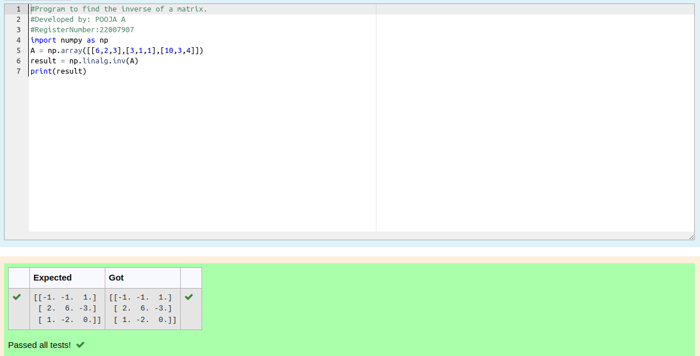

# INVERSE-OF-A-MATRIX

## Aim:
To write a python program to find the inverse of a matrix

## Equipment’s required:
1. 	Hardware – PCs
2. 	Anaconda – Python 3.7 Installation / Moodle-Code Runner

## Algorithm:
### Step1 :
import numpy as np
 ### Step 2:
 take A=np.array with input 
### Step 3: 
using result = np.linalg.inv(A) to find inverse of matrix
### Step 4: 
print the result
### step 5:
end the program

## Program:
```python
#Program to find the inverse of a matrix.
#Developed by: POOJA A
#RegisterNumber:22007907
import numpy as np
A = np.array([[6,2,3],[3,1,1],[10,3,4]])
result = np.linalg.inv(A)
print(result)
```
## Output:


## Result:
Thus the inverse of given matrix is successfully solved using python program

